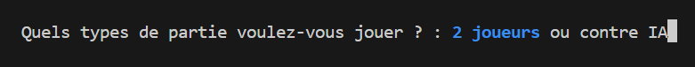
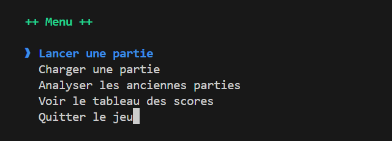
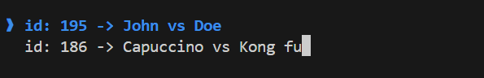

# Chess on terminal

Ce projet vise à réaliser un jeu d'échec complet sur le terminal avec le language séquentiel C.

Fonctionnalités:
1. Lancer une partie multijoueur
1. Sauvegarder une partie
1. Charger une partie
1. Analyser des parties
1. Lancer une partie contre ia

>Les fonctionnalités 4 et 5 ne sont pas encore implémenter.

Auteurs: 

- [@YannDste, yannsonfack@gmail.com](https://github.com/YannDste)
- [@roo7690, roosevelt@roo7690.me](https://github.com/roo7690)

## Installation

Pour lancer le jeu, veuillez suivre ces étapes.

```sh
git clone https://github.com/archiveSonf/chess.git ./chess
make install
make compil
make run
```

## Architecture

- **dist** : contient le fichier executables chess.exe
- **assets** : contient les fichiers de données écrit en json.
- **src** : module d'entrée du programme. 
- **tools** : module contenant les modules utiles dans le programme.
    - **[board](#Board)** : module contenant les méthodes de jeu.
    - **[menu](#Menu)** : module contenant les méthodes de sélection d'options.
    - **[env](#Env)** : module contenant les méthodes de mise en place de l'interface.
    - **[data](#Data)** : module contenant les méthodes d'écriture et lecture de données.

## Env
## Menu

Les méthodes du module `menu` permettent de proposer des options de fonctionnalités pour qu'il les sélectionne via les touches de directions.

### [`select_bool`](https://github.com/archiveSonf/chess/blob/chess/tools/menu/bool.c)

Permet de proposer 2 options



```c
option bools[2]={
  {run_game_2,"2 joueurs"},
  {run_game_ia,"contre IA"}
};

options res=select_bool("Quels types de partie voulez-vous jouer ?",bools);

//options est un type d'enumérateur, 
//prenant entre autre les valeurs run_game_2 et run_game_ia
```

### [`select_list`](https://github.com/archiveSonf/chess/blob/chess/tools/menu/list.c)



```c
option opts[5]={
  {run_game,"Lancer une partie"},
  {load_game,"Charger une partie"},
  {analyz_old_game,"Analyser les anciennes parties"},
  {see_scores,"Voir le tableau des scores"},
  {quitter,"Quitter le jeu"}
};

options res=select_list("Menu",5,opts);

//options est un type d'enumérateur, 
//prenant entre autre les valeurs run_game et quitter
```

### [`select_partie`](https://github.com/archiveSonf/chess/blob/chess/tools/menu/list.c)

`select_partie` utilise une méthode du module `data` pour récupérer une liste de parties et les proposer en options



```c
int select_partie(Partie *partie,int nbr_partie);
```

## Board
## Data

Les méthodes du module ``data`` utilise la bibliothèque `jansson.h` pour stocker lire des données au format json.

### [`SaveGame`](https://github.com/archiveSonf/chess/blob/chess/tools/data/save.c)

Cette méthode permet de sauvagarder une partie terminée ou encours, pour la continuer plustard ou l'analyser.

```c
// Sauvegarde la partie
int SaveGame(char *db_file); 

// db_file => chemin relatif vers la fichier de base de données
// renvoie 1 si l'opération est une réussite.
```

### [`LoadGame`](https://github.com/archiveSonf/chess/blob/chess/tools/data/load.c)

`LoadGame` permet de charger une partie depuis une base de données.

```c
int id=14; //id de la partie
char *db_file="chemin/vers/base/de/données";

GAME *game=LoadGame(id,db_file);
if(game!=NULL)
    runGame(game,NULL,NULL);
```

### [`LoadGames`](https://github.com/archiveSonf/chess/blob/chess/tools/data/load.c)

Cette méthode charge des informations sur les parties sauvegardées sous la structure `Partie`.
```c
typedef struct _partie{
  int id;
  char* player1;
  char* player2;
  struct _partie *next;
  struct _partie *previous;
} Partie;
```
```c
int nb_partie;
char *db_file="chemin/vers/base/de/données";

//Retourne la liste des parties
Partie *list_parties=LoadGames(db_file,&nb_partie);
```
